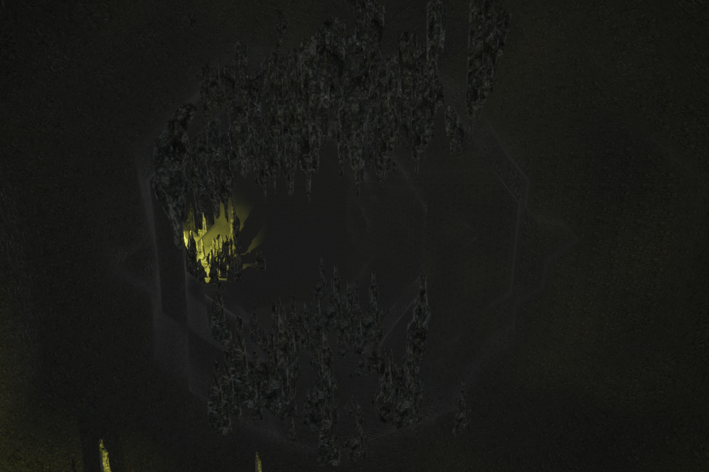

# MRS FlightForge Simulator


## Requirements

* A dedicated NVidia GPU (at least MX450, RTX is recommended) or a comparable AMD GPU
* 3 GB of HDD space

## The Maps

| Map Name  |                         | Map Name       |                               |
|-----------|-------------------------|----------------|-------------------------------|
| Valley    |     | Cave           |             |
| Forest    |     | Erding Airbase |   |
| Warehouse |  | Infinite forest |  |

## Controls

* `m`/`ESC` - show menu for switching graphics and worlds

## Installation

### Linux

1. Install the [MRS UAV System](https://github.com/ctu-mrs/mrs_uav_system)
2. Install the MRS UAV System FlightForge endpoint
```bash
sudo apt install ros-noetic-mrs-uav-unreal-simulation
```
3. Download the and unpack [MRS FlightForge simulator](https://nasmrs.felk.cvut.cz/index.php/s/MnGARsSwnpeVy5z)
4. Launch the FlightForge Simulator by `./mrs_flight_forge.sh`. Alternatively, start it in a headless mode via `./mrs_flight_forge.sh -RenderOffscreen`.
6. Start the MRS UAV System FlightForge endpoint
```bash
roscd mrs_uav_unreal_simulation
./tmux/one_drone/start.sh
```

### Windows

Requirements:
* Windows 11 + updates
* WSL 2.0

1. Install Ubuntu 20.04 into the WSL 2.0 using the Microsoft Store
2. Install the [MRS UAV System](https://github.com/ctu-mrs/mrs_uav_system) into WSL 2.0
3. Create `.wslconfig` file in `C:/Users/<User>/.wslconfig`
4. Place the following content into `.wslconfig`
```
[wsl2]
firewall=false
networkingMode=mirrored
debugConsole=false
[experimental]
hostAddressLoopback=true
```
5. Restart the WSL by issuing `wsl --shutdown` into a comand line.
6. Install the MRS UAV System FlightForge endpoint
```bash
sudo apt install ros-noetic-mrs-uav-unreal-simulation
```
7. Download and unpack the [FlightForge Simulator](https://nasmrs.felk.cvut.cz/index.php/s/MnGARsSwnpeVy5z)
8. Start the FlightForge Simulator
9. Start the MRS UAV System FlightForge endpoint
```bash
roscd mrs_uav_unreal_simulation
./tmux/one_drone/start.sh
```
10. The first start might require hitting "CTRL+C" in the `roscore` tab of the tmux session. The roscore is always stuck for the first time after rebooting the computer.

## Citing this work

If you use this simulator in your research, please cite the following paper:

```@article{čapek2025flightforge,
  title   = {FlightForge: Advancing UAV Research with Procedural Generation of High-Fidelity Simulation and Integrated Autonomy},
  author  = {David Čapek and Jan Hrnčíř and Tomáš Báča and Jakub Jirkal and Vojtěch Vonásek and Robert Pěnička and Martin Saska},
  year    = {2025},
  journal = {arXiv preprint arXiv: 2502.05038},
  url     = {https://arxiv.org/abs/2502.05038v1},
  pdf     = {https://arxiv.org/pdf/2502.05038.pdf}
}
```

## Planned features

* Adding back a grayscale normalized depth image
* possible coloring of the depth pointcloud using the segmented RGB image
